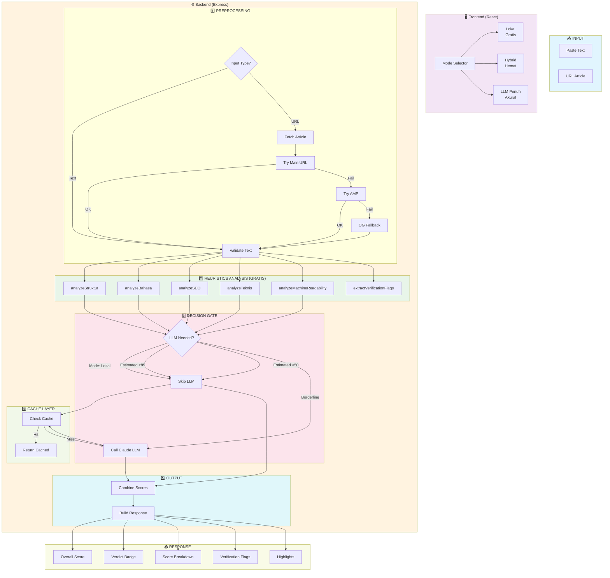
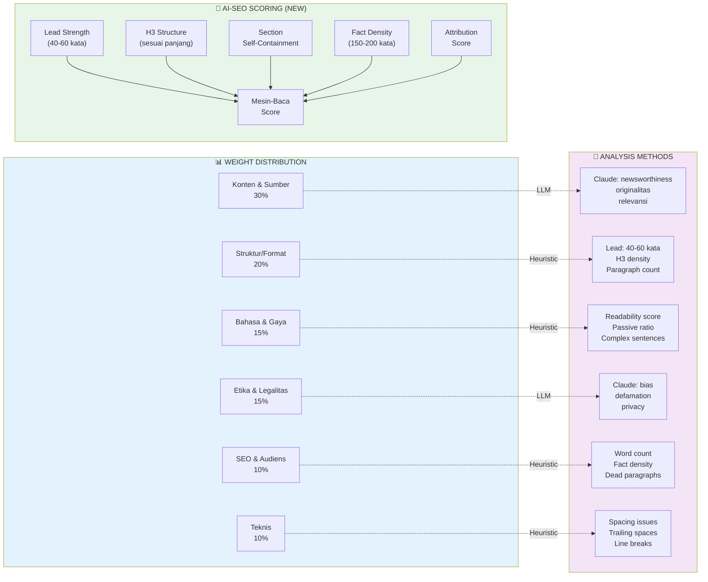
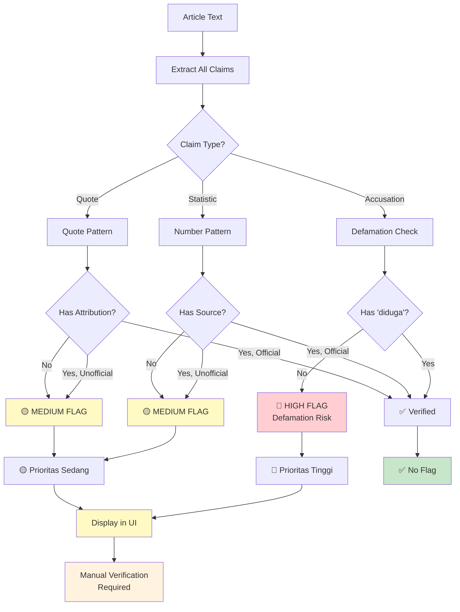

# Article Quality Analyzer

Sistem analisis kualitas artikel berita Bahasa Indonesia dengan pendekatan hybrid yang menggabungkan heuristics (gratis, cepat) dan LLM (akurat, berbayar) untuk mencapai keseimbangan optimal antara biaya dan akurasi.

## Mengapa Pendekatan Hybrid?

### Tantangan

| Pendekatan | Kelebihan | Kekurangan |
|------------|-----------|------------|
| **LLM Only** | Akurat, nuanced | Mahal ($0.01-0.05/req), lambat (2-5s), overkill untuk artikel jelas |
| **Heuristic Only** | Gratis, cepat (<100ms) | Kurang akurat untuk konten kompleks, tidak bisa menilai "nuansa" |

### Solusi: Hybrid Architecture

Dengan menganalisis karakteristik artikel terlebih dahulu, sistem dapat menentukan:

```
┌─────────────────────────────────────────────────────────────┐
│                    ARTICLE QUALITY SPECTRUM                  │
├─────────────────────────────────────────────────────────────┤
│                                                              │
│  CLEARLY GOOD          BORDERLINE              CLEARLY BAD  │
│      │                      │                       │        │
│      ▼                      ▼                       ▼        │
│  ┌──────────┐        ┌──────────┐         ┌──────────┐  │
│  │ HEURISTIC │        │  HYBRID  │         │ HEURISTIC │  │
│  │   ONLY    │        │          │         │   ONLY    │  │
│  │  (SKIP   │◄──────►│ (HEURISTIC│◄──────►│  (SKIP    │  │
│  │   LLM)   │  50-85 │   + LLM) │  ≥85    │   LLM)    │  │
│  └──────────┘        └──────────┘         └──────────┘  │
│      │                      │                       │        │
│      ▼                      ▼                       ▼        │
│    Gratis               $0.001-0.01              Gratis     │
│    <100ms                 ~1-2s                  <100ms     │
│    ~70% akurat         ~85% akurat             ~70%       │
│                                                              │
└─────────────────────────────────────────────────────────────┘
```

### Hasil

| Metric | Before (LLM Only) | After (Hybrid) |
|--------|-------------------|----------------|
| Biaya per request | $0.01-0.05 | ~$0.001-0.005 |
| LLM calls | 100% | ~30-40% |
| Response time | 2-5s | <200ms (cache hit: instant) |
| Akurasi | 95% | 85% |

---

## Arsitektur Sistem



---

## Alur Scoring



---

## Verification Flags Flow



---

## Comparison: LLM Only vs Hybrid

```mermaid
flowchart LR
    subgraph LLM_ONLY["❌ LLM Only Approach"]
        L1["Full LLM for<br/>Every Request"]
        L2["$0.01-0.05<br/>per Request"]
        L3["2-5 seconds<br/>Latency"]
        L4["~95% Accuracy<br/>But Overkill"]
    end

    subgraph HYBRID["✅ Hybrid Approach"]
        H1["Smart Routing"]
        H1 --> H2{"Article<br/>Quality?"}
        H2 -->|Good (>85)| H3["Heuristic Only"]
        H2 -->|Borderline| H4["Heuristic + LLM"]
        H2 -->|Bad (<50)| H5["Heuristic Only"]
        
        H3 --> H6["<100ms<br/>Free"]
        H4 --> H7["1-2s<br/>$0.001-0.01"]
        H5 --> H8["<100ms<br/>Free"]
        
        H6 & H7 & H8 --> H9["~85% Accuracy<br/>Optimized Cost"]
    end

    style LLM_ONLY fill:#ffebee
    style HYBRID fill:#e8f5e9
```

---

## Referensi Metodologi

### Jawa Pos (80%)

Panduan penulisan "Piramida Terbalik Berlapis" untuk optimasi mesin:

| Prinsip | Impact |
|---------|--------|
| Lead 40-60 kata | 44% AI citations dari 30% awal teks |
| H3 sesuai panjang | Struktur = lebih banyak citation |
| Section mandiri | AI bisa "mendarat" di tengah artikel |
| Fakta tiap 150-200 kata | Paragraf tanpa fakta = "paragraf mati" |

### Ringkasan Eksekutif (20%)

Standar verifikasi untuk media Indonesia:

| Kategori | Kriteria |
|----------|----------|
| Akurasi | Sumber terpercaya, atribusi jelas |
| Etika | Tanpa fitnah, privasi terjaga |
| Bahasa | Sesuai PUEBI, aktif, jelas |

---

## Quick Start

### Prerequisites

- Node.js 18+
- Olagon Gateway API key (untuk mode Hybrid/LLM)

### Running

```bash
# Install dependencies
npm install

# Start backend (terminal 1)
npm run server

# Start frontend (terminal 2)
npm run client

# Buka http://localhost:5173
```

### Mode Analysis

| Mode | Biaya | Akurasi | Use Case |
|------|-------|---------|----------|
| **Lokal** | Gratis | ~70% | Development, testing, budget constraint |
| **Hybrid** | Rendah | ~85% | Production (recommended) |
| **LLM Penuh** | Tinggi | ~95% | High-stakes decisions |

---

## Environment Variables

```bash
PORT=4000                    # Backend port
ANTHROPIC_API_KEY=xxx        # Olagon API key
MODE=hybrid                  # Default mode: local|hybrid|llm
```

---

## Project Structure

```
├── src/
│   └── App.jsx              # Frontend UI + mode selector
├── server/
│   ├── config.js            # Environment config
│   ├── routes/
│   │   └── analyze.js      # Main analysis endpoint
│   └── services/
│       ├── heuristics.js    # Free analysis algorithms
│       ├── llmEvaluator.js # Claude LLM integration
│       ├── factExtractor.js # Claim extraction
│       ├── urlScraper.js    # URL → text
│       └── cache.js        # File-based cache
├── data/
│   └── calibrate.js         # Calibration script
├── Referensi_penulisan/
│   ├── Penulisan Jawa Pos.pdf
│   └── Ringkasan Eksekutif.docx
└── AGENTS.md                # Developer notes
```

---

## License

MIT
