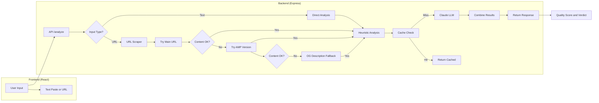

# Article Quality Analyzer

Indonesian news article quality analyzer using hybrid heuristics + Claude LLM.

  

## What It Does

Analyzes Indonesian news articles for quality based on 6 criteria:

| Category | Weight | Analysis Method |
|----------|--------|-----------------|
| Konten & Sumber | 30% | Claude LLM |
| Struktur/Format | 20% | Heuristics |
| Bahasa & Gaya | 15% | Heuristics + LLM |
| Etika & Legalitas | 15% | Claude LLM |
| SEO & Audiens | 10% | Heuristics |
| Pemeriksaan Teknis | 10% | Heuristics |

## Architecture



## Tech Stack

- **Frontend**: React 18, Vite, Tailwind CSS
- **Backend**: Express.js, Node.js
- **AI**: Claude via Olagon Gateway
- **Scraping**: Cheerio with AMP fallback

## Quick Start

### Prerequisites

- Node.js 18+
- Olagon Gateway API key

### Installation

```bash
# Clone the repository
git clone <repo-url>
cd Article-Quality-Analysis-Website

# Install dependencies
npm install

# Configure environment
cp .env.example .env
# Edit .env and add your ANTHROPIC_API_KEY
```

### Running

```bash
# Start backend (terminal 1)
npm run server

# Start frontend (terminal 2)
npm run client
```

Open [http://localhost:5173](http://localhost:5173)

## Usage

### Paste Article

1. Select "Paste Artikel" tab
2. Paste article text
3. Click "Mulai Analisis"

### URL Analysis

1. Select "Analisis URL" tab
2. Enter article URL
3. Click "Mulai Analisis"

**Supported sites with AMP fallback:**
- manadopost.jawapos.com
- detik.com
- kompas.com
- tribunnews.com
- sindonews.com
- republika.co.id
- merdeka.com
- cnnindonesia.com
- jpnn.com

## API

```bash
POST /api/analyze
Content-Type: application/json

# Paste text
{ "text": "article content..." }

# URL
{ "url": "https://example.com/article" }
```

**Response:**

```json
{
  "overallScore": 75,
  "verdict": "Layak terbit",
  "summary": "...",
  "details": [
    { "name": "Konten & Sumber", "value": "70", "text": "..." },
    { "name": "Struktur/Format", "value": "85", "text": "..." },
    ...
  ],
  "highlights": [
    { "type": "warn", "text": "...", "note": "..." }
  ]
}
```

## Verdict Thresholds

| Score | Verdict | Color |
|-------|---------|-------|
| ≥75 | Layak terbit | Green |
| ≥50 | Perlu revisi | Yellow |
| <50 | Ditolak | Red |

## Scripts

```bash
npm run client    # Frontend only (Vite)
npm run server    # Backend only (Express)
npm run dev       # Alias for client
npm run build     # Production build
npm run preview   # Preview production build

# Calibration
node data/calibrate.js data/raw/sample.csv
```

## Environment Variables

| Variable | Default | Description |
|----------|---------|-------------|
| `PORT` | 4000 | Backend server port |
| `ANTHROPIC_API_KEY` | - | Olagon Gateway API key (required) |

## Project Structure

```
├── src/                    # React frontend
│   ├── App.jsx            # Main component
│   └── index.css          # Tailwind styles
├── server/                 # Express backend
│   ├── index.js           # Server entry
│   ├── routes/
│   │   └── analyze.js    # Analysis endpoint
│   └── services/
│       ├── heuristics.js  # Free text analysis
│       ├── llmEvaluator.js # Claude LLM
│       ├── urlScraper.js  # URL → text
│       └── cache.js       # Result caching
├── data/
│   └── calibrate.js       # Calibration script
├── AGENTS.md              # Agent instructions
└── package.json
```

## License

MIT
